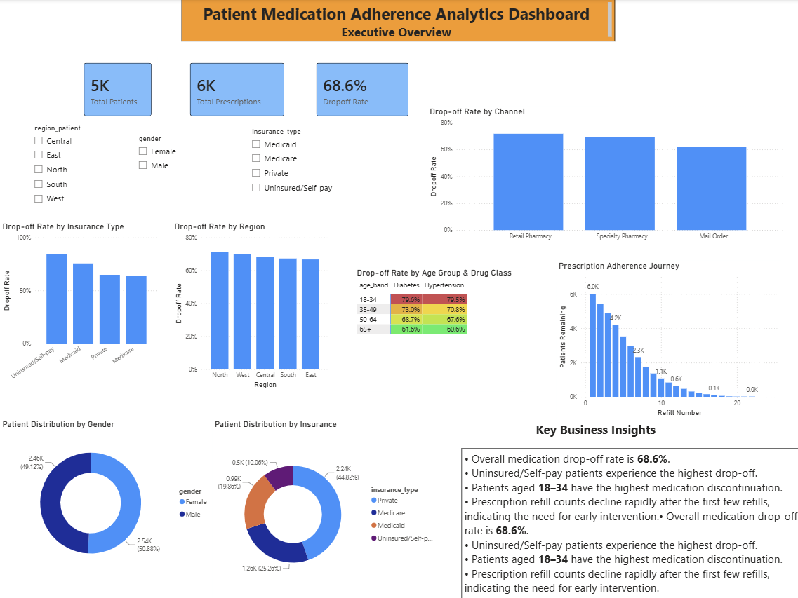
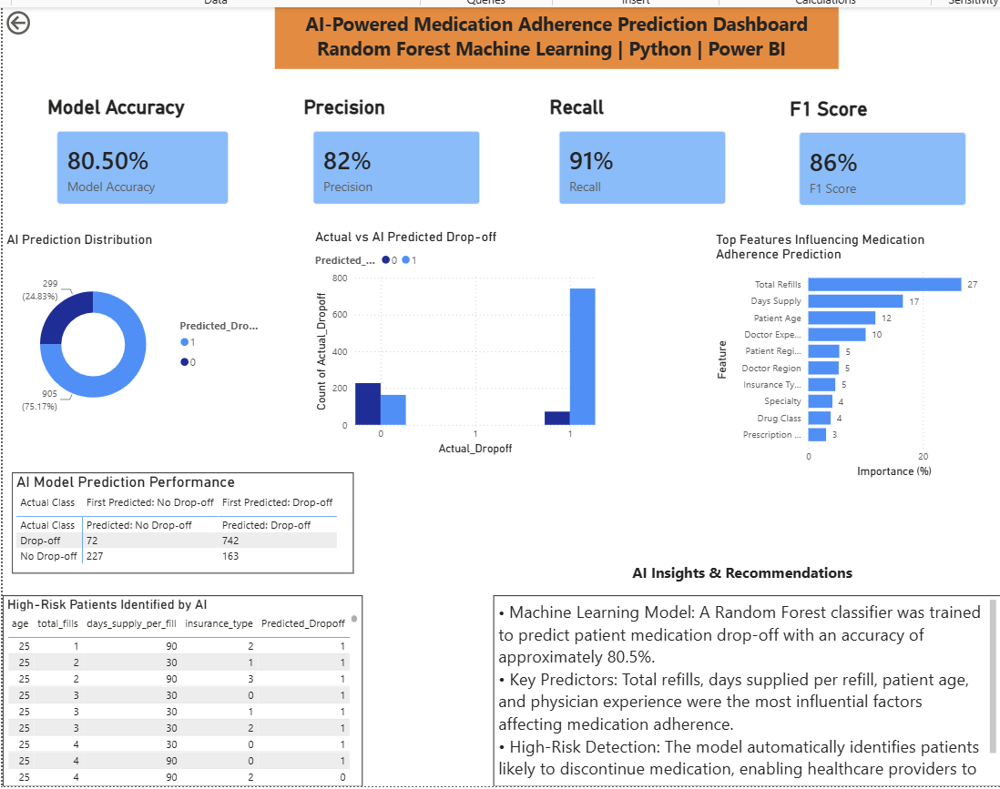

#  Patient Medication Adherence Analytics

### End-to-End Healthcare Analytics & Machine Learning Project

**SQL | Python | Random Forest | Power BI**

---

##  Project Overview

Medication non-adherence is one of the leading causes of poor treatment outcomes and increased healthcare costs. This project analyzes patient medication adherence patterns using SQL and Power BI while leveraging a Random Forest Machine Learning model to predict patients who are at risk of discontinuing their medication.

The project follows a complete analytics lifecycle, including SQL-based data extraction, Python data preprocessing, Random Forest machine learning, and interactive Power BI dashboards to support healthcare decision-making.
---

#  Business Objectives

- Analyze medication adherence trends.
- Identify patients at risk of treatment drop-off.
- Understand the impact of insurance type, age, region, and prescribing channel.
- Build a machine learning model for patient drop-off prediction.
- Create interactive dashboards for business and AI insights.

---

# Tech Stack

| Technology | Purpose |
|------------|----------|
| MySQL | Data Storage & SQL Analysis |
| Python | Data Cleaning & Machine Learning |
| Pandas | Data Manipulation |
| NumPy | Numerical Computing |
| Scikit-learn | Random Forest Model |
| Power BI | Interactive Dashboard & Visualization |

---

#  Project Workflow

```text
Raw Healthcare Data
        │
        ▼
     MySQL Database
        │
        ▼
 SQL Data Analysis
        │
        ▼
 Python Data Cleaning
        │
        ▼
 Feature Engineering
        │
        ▼
Random Forest Classifier
        │
        ▼
Patient Drop-off Prediction
        │
 ┌──────┴───────────┐
 ▼                  ▼
Business Dashboard  AI Dashboard
```

---

# 📊 Dashboard Preview

## Business Dashboard



---

## AI Prediction Dashboard



---

# 📈 Business Dashboard Features

- Executive KPI Dashboard
- Medication Drop-off Analysis
- Insurance-wise Analysis
- Region-wise Analysis
- Gender Distribution
- Patient Refill Journey
- Age Group vs Drug Class Heatmap

---

# 🤖 AI Dashboard Features

- Random Forest Prediction Model
- Model Accuracy
- Precision
- Recall
- F1 Score
- Feature Importance
- Confusion Matrix
- Prediction Distribution
- High-Risk Patient Identification

---

# 🧠 Machine Learning Model

**Algorithm Used**

- Random Forest Classifier

**Model Performance**

| Metric | Score |
|--------|--------|
| Accuracy | 80.5% |
| Precision | 82% |
| Recall | 91% |
| F1 Score | 86% |

---

# 💡 Key Insights

- Insurance type significantly influences medication adherence.
- Younger patients demonstrate comparatively higher treatment discontinuation.
- Patients with fewer prescription refills are more likely to drop off.
- The Random Forest model effectively identifies patients requiring early intervention.
- Interactive dashboards support faster and more informed healthcare decision-making.

---

# 📁 Repository Structure

```text
Patient-Medication-Adherence-Analytics
│
├── Dashboard
│   └── Patient_Medication_Adherence_Analytics.pbix
│
├── Dataset
│   └── adherence_flat.csv
│
├── Images
│   ├── business_dashboard.png
│   └── ai_dashboard.png
│
├── Python
│   ├── adherence_prediction.py
│   └── patient_predictions.csv
│
├── SQL
│   ├── Database_Setup.sql
│   └── Analysis_Queries.sql
│
└── README.md
```

---

# 🚀 Future Improvements

- Deploy the machine learning model using Streamlit.
- Integrate real-time healthcare data.
- Improve prediction accuracy using advanced ensemble models.
- Add automated patient risk alerts.

---

# 👩‍💻 Author

**Nikita Chakraborty**

Chemical Engineering Undergraduate | Data Analytics Enthusiast
